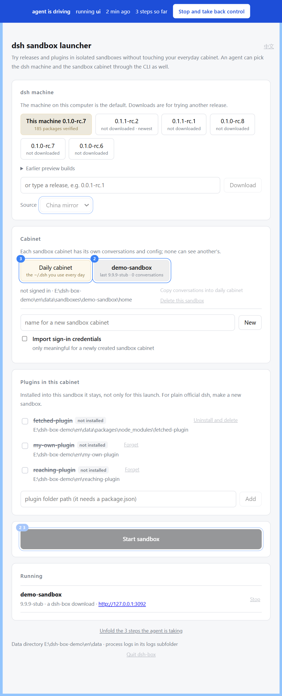

<div align="center">

  <h1>dsh-box</h1>

  <p>
    
    
    
  </p>

  <p><a href="README.md">中文</a> | English</p>

  <p>Pick an official release, run an isolated dsh<br/>Every button is a command you could have typed<br/>When an agent drives, the window shows every step it takes<br/>Take the wheel back anytime; close the window and nothing is lost</p>

  <p>
    <a href="#quick-start"><strong>Quick Start</strong></a>
    ·
    <a href="#for-agents"><strong>For Agents</strong></a>
    ·
    <a href="#commands"><strong>Commands</strong></a>
    ·
    <a href="#what-a-sandbox-is"><strong>What a Sandbox Is</strong></a>
  </p>

  <p>
    
    = 20" />
    
  </p>

  <p><sub>Built with Fable 5</sub></p>

</div>

---

**0.3.3: plugins from npm now install — and actually boot.**

Most third-party plugins on npm ship without their official dependencies: they expect to borrow parts from whichever dsh is running. Installed through dsh-box, such a package used to make dsh refuse its whole plugin tree — the parts were never findable. This release fixes that at the root: **one download, and each dsh release gets its own version-matched shelf of official parts beside it** (hardlinks, no extra disk), so a sandbox stays correct whichever release boots it. **Installing into your daily cabinet copies the whole thing in** — after that your own `dsh` loads it, and deleting dsh-box costs it nothing.

The window caught up too: install a plugin **from npm by name**, watch the download live, and see each plugin's version in its row. As always, every button is a command you could have typed.

## Quick Start

```bash
npx dsh-box ui        # the window opens in your browser, nothing to install
```

**Mind which directory you type that in** — the data lands in `dsh-box-files/data` under it. Run from one folder today and another tomorrow and you get two data directories that cannot see each other; sandboxes look "gone" when they are simply elsewhere. To pin it down, see [The Data Directory](#the-data-directory).

**For a double-clickable native window, grab an installer from [Releases](https://github.com/33moren33/dsh-box/releases).** Both routes are the same program: the same local service, the same page.

**⭐ From 0.3.5 that exe is also a command line**: double-clicked it is a window, given arguments it is the command line.

```bash
dsh-box.exe status --json     # installed or portable: arguments make it a CLI
dsh-box.exe path add          # put its folder on your own PATH
dsh-box                       # once on PATH, from any directory
```

⛔ **0.3.4 and earlier have no such face**: arguments made it hang without answering, and the file was named `dsh-box-shell.exe`. From 0.3.5 it is `dsh-box.exe` everywhere. The installer runs `path add` for you; with the portable zip you run it once yourself. **The global npm install needs none of this** — npm already puts its shim on PATH.

Once the window is open it is three steps: **pick a dsh → pick a cabinet → start**. With no release named it uses the dsh you installed yourself; name a downloaded release and the first run fetches it (about 200–260MB), after that it is reused.

<div align="center">
  
  <br/><sub>The config window while an agent is driving</sub>
</div>

Skip the window and give commands instead — every step stands on its own:

```bash
npx dsh-box versions                                  # what npm has, what is already downloaded
npx dsh-box pull 0.1.1-rc.2                           # download an official release
npx dsh-box plugins add ./my-plugin                   # remember a local plugin folder
npx dsh-box plugins install dsh-memory-pyramid --sandbox trial   # install a plugin from npm into a sandbox
npx dsh-box start --new --plugin my-plugin            # new sandbox, with that plugin installed
npx dsh-box status --json                             # add --json to any command, for scripts and agents
```

From source it is `node bin/cli.js ui`.

## For Agents

The command line was built for this: it has `--help`, and `--json` on any command answers in JSON. **A failure is JSON too, and carries a `code` that never changes.** So there is no long-running HTTP API here and no MCP — a middle layer would add nothing.

What is new is taking over:

```bash
npx dsh-box attach          # I am driving
npx dsh-box detach          # hand it back
npx dsh-box memory          # what the last takeover did, refusals included
npx dsh-box history         # everything ever done in this data directory
```

After `attach`, a blue band appears across the top of the config window, every control about to be touched gets a number, and a **trail of commands** unfolds below — each step rendered as a line you could re-run. What was done, what was refused, and why, are all on it.

**The lock is in the server, not on the page.** While an agent drives, every command the window sends is refused outright; only "stop and take back control" gets through. The greying-out on the page is therefore pure decoration: label a control wrongly and the worst case is that it looks clickable and says something when clicked. **It can no longer become damage.**

One test says it all: **close the window, open it again, and nothing is lost.**

## Two Words First

| Word | What it is |
|---|---|
| **Cabinet** | One `DSH_HOME`. Conversations, config, sign-in. This is what `--sandbox <name>` and `--main` are about |
| **Workspace** | The **project folder** dsh works in. This is dsh's own term |

## One Launch = Two Axes

```
start  =  which dsh (machine)  ×  which cabinet (DSH_HOME)
```

- **Machine**: unnamed means **the dsh you installed yourself**; `--version <release>` uses a release dsh-box downloaded.
- **Cabinet**: `--sandbox <name>` an existing sandbox / `--new` a fresh one / `--main` your everyday `~/.dsh`.

**Nothing carries over from last time.** Release, sandbox and workspace all used to be remembered; all three were removed. The same command always gives the same result, and that matters more than saving a few keystrokes.

**There is exactly one gate**: opening your real `~/.dsh` with a downloaded release. That square is refused on the spot and only runs after a person has agreed in the config window. Nothing else prompts — a dialog in front of a reversible action only trains people to dismiss the one that matters.

## Plugins Belong to the Cabinet

Not to the launch. A plugin installed into a cabinet is written into that cabinet's own config, so **typing `dsh` yourself loads it too**.

- `--plugin <id>` adds, `--unplug <id>` removes, **naming neither changes nothing**.
- Want plain official dsh? Make a new sandbox.
- Local folders and npm packages both work. A local one is linked, so editing the source is live on the next launch.
- An npm package downloads once and serves every sandbox and every dsh release; each launch aims it at that release's own official parts automatically.
- Installing into the daily cabinet copies the whole thing in — after that your own `dsh` loads it without dsh-box, and deleting dsh-box changes nothing.
- Every change is backed up first and `plugins restore` puts the whole file back. Uninstalling returns it **byte for byte** — verified by hash, not by eye.

## Commands

```
versions / pull <release> / drop <release>        download and manage dsh releases
sandboxes / start / stop / rm <name>              start, stop and delete sandboxes
adopt --from <name|main> --to <name|main>         copy conversations between cabinets
plugins [--sandbox <name> | --main]               the register, or what a cabinet actually has
plugins add / rm                                  remember a plugin folder / get rid of one entirely
plugins install / uninstall                       into a cabinet / out of a cabinet
plugins backups / backups rm / prune / restore    backups of the plugin config
packages / packages rm / packages prune           plugin packages dsh-box downloaded for you
workspaces / workspaces use <folder>              which project folder this cabinet opens next
attach / detach / memory / history                take over, hand back, review
config / config source / config lang              settings: install source, language
path / path add / path rm                         whether this copy is on PATH; put it on, take it off
status / logs <name> / ui / quit                  overview, logs, config window, quit everything
```

Details are in `help <command>` (say `help start`). **The machine-readable one is `--help --json`**, and what it returns is the very table this command line runs on.

## Language

English and Chinese are both built in and switchable. The language is a setting **of the data directory**, not a preference of the page:

```bash
npx dsh-box config lang zh
```

The command line and the config window change together. The switch in the top right corner of the window runs exactly that command — so the window still has no capability of its own. Unset, it follows this computer's system language.

## The Data Directory

Downloaded releases, every sandbox, plugin packages and the process logs all live in one folder called `data`. **The data travels with the program, and none of it lives in the browser** — the config window is only a view, so clearing browser data and cookies loses nothing:

- Run through `npx` or from source and it is created under your current directory, at `dsh-box-files/data`.
- Install the desktop build or unpack the portable one and it sits next to the exe, in `dsh-box-files/`. That folder holds two things: `boot` is the program, `data` is your belongings. **Unpacking over the top is the upgrade — `boot` is replaced, `data` is untouched.** Only when the exe lives somewhere unwritable (Program Files, say) does the data fall back to your user directory.

**If you run through `npx`, pin the location down**: either always run from the same folder, or set `DSH_BOX_HOME=<folder>` once (`--box <folder>` works for a single command) and every run finds the same data wherever you type it. Missing a sandbox? Look at the **first field** of any command's output — that is the data directory it is using.

If a folder of that name is already there, has things in it, and was not made by this tool, the tool picks another name rather than writing into someone else's directory.

## What You Need

**Node 20 or newer. That is all.**

dsh ships through npm and its entry point is a Node script, so without Node there is no dsh to run. Nothing else is required; the tool itself has no runtime dependencies.

**It imports no `@deepseek-ai` package.** Changes to the official plugin interface do not concern it: it stays outside the dsh process and only makes directories, writes config files, sets `DSH_HOME`, and starts the official dsh.

### Windows: some Node versions cannot handle non-ASCII paths

A defect in Node itself, not in this tool ([#61067](https://github.com/nodejs/node/issues/61067), [#61878](https://github.com/nodejs/node/issues/61878)). Recursive delete and recursive copy, given a path holding an accented letter, Chinese, Japanese or an emoji, **report success and do nothing** — and on some shapes they take the process down. **This tool works around both, so it behaves the same on every version below.**

| Fine | Defective |
|---|---|
| 20.x, 21.x | **22.17 – 22.21** (the current LTS, still unfixed) |
| 22.0 – 22.16 | the whole 23 line |
| **24.15 or newer** | 24.0 – 24.14 |
| 25.9 or newer, 26.x | 25.0 – 25.8 |

Every cell was measured by downloading that version and running it. Windows only; Linux and macOS are unaffected.

It is here because the other Node programs on your machine may not work around it. Anyone whose user name is `José` or `Müller` has these characters in every path they own. **For a clean one, install 24.15 or newer.**

## What a Sandbox Is

A sandbox is one `DSH_HOME` — the whole cabinet of a dsh: which plugins are installed, the config, the workspace register, and **every conversation**. Hand it a new cabinet and you have a brand new dsh; delete the folder and that dsh ceases to exist. There is no uninstall step.

**A sandbox is not a security boundary.** It separates `DSH_HOME` and nothing else: the permissions are exactly those of your everyday dsh — it can read and write your files and spend your real money. What is separated is releases, plugins, config and conversations, not this computer.

Three things worth knowing:

**Conversations belong to the cabinet they happened in.** Two sandboxes opening the same project folder see different histories.

**A sandbox uses your real sign-in.** Importing it is on by default so you do not reconfigure an API key per sandbox; conversations in a sandbox are real requests and are really billed.

**Conversations can be brought back.** `adopt` copies them from one cabinet into another, idempotent per session, so running it twice adds nothing.

## Network

Downloading a release needs the npm registry. The tool **does not decide about your proxy for you**: it tries a direct connection first, uses it if it works, falls back to whatever proxy your system is configured with, and writes down which one it took. Bypassing the proxy applies to the registry domain only; everything else is left alone.

## Desktop Shell

```
npx tauri build
```

This produces the double-clickable window and an NSIS installer. The shell is written in Rust and does four things: find the system Node, pick a free port, start the same Node service as above, and reap the whole process tree when the window closes. **The page and the logic are the same ones the browser gets.**

Building needs the Rust toolchain. macOS and Linux artifacts have to be produced on those systems; they cannot be cross-built from Windows. Both platforms stop an unsigned program once: on Windows click **More info → Run anyway**, on macOS it is Gatekeeper.

## FAQ

<!-- to be filled in from real use and issues -->

## License

MIT
