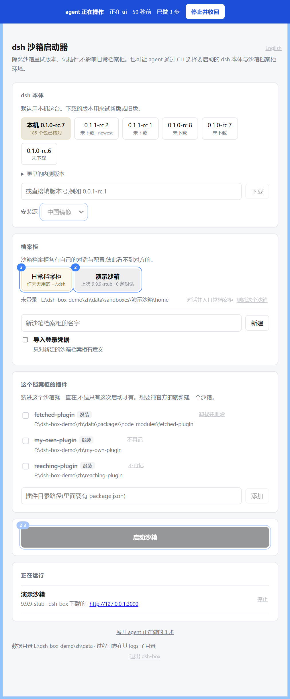

<div align="center">

  <h1>DSH 沙箱</h1>

  <p>
    
    
    
  </p>

  <p>中文 | <a href="README.en.md">English</a></p>

  <p>选一个官方版本，开一台隔离的 dsh<br/>每个按钮背后，都是一条你也能敲的命令<br/>Agent 自己驾驶时，窗口如实显示它走的每一步<br/>随时一键收回控制权，窗口关掉再打开，什么都不丢</p>

  <p>
    <a href="#快速开始"><strong>快速开始</strong></a>
    ·
    <a href="#agent-怎么用"><strong>Agent 怎么用</strong></a>
    ·
    <a href="#命令"><strong>命令</strong></a>
    ·
    <a href="#沙箱是什么"><strong>沙箱是什么</strong></a>
  </p>

  <p>
    
    = 20" />
    
  </p>

  <p><sub>Fable 5 辅助</sub></p>

</div>

---

**0.3.3：npm 上的插件，装得上，也起得来了。**

npm 上的第三方插件多数不随包带官方依赖——它们指望在运行的那台 dsh 身上现拿零件。以前从 dsh-box 装这类包，dsh 会因为找不到零件拒载整棵插件树。这一版从根上解决：**下载一次，每个 dsh 版本各配一套对版的零件货架**（硬链接，不占多余磁盘），沙箱换哪个版本启动都自动对版；**装进日常档案柜则是整份拷进去**——之后你自己敲 `dsh` 一样加载，把 dsh-box 删掉也毫发无损。

窗口也跟上了：插件可以直接**从 npm 按包名装**，下载进度实时可见，插件行显示版本号。照旧，每个按钮背后都是一条你也能敲的命令。

## 快速开始

```bash
npx dsh-box ui        # 界面开在浏览器里，不用安装
```

**注意你在哪个目录敲的这条命令**——数据就建在那个目录下的 `dsh-box/data`。今天在 D 盘敲、明天在 E 盘敲，会得到两个互相看不见的数据目录，沙箱像是"丢了"，其实在另一个文件夹里。想固定住，见[数据目录](#数据目录)。

**想要双击打开的原生小窗，去 [Releases](https://github.com/33moren33/dsh-box/releases) 下安装包。** 两条路是同一个程序的两张皮——同一个本地服务、同一张页面。

配置窗打开后是三步：**选一台 dsh → 选一个档案柜 → 起**。不选版本就用你自己装的那台 dsh；选了下载的版本，第一次会下（约 200–260MB），之后复用。

<div align="center">
  
  <br/><sub>agent 正在驾驶时的配置窗</sub>
</div>

不想用界面就直接给命令，每一步都能单独跑：

```bash
npx dsh-box versions                                  # npm 上有哪些版本，本地已下载哪些
npx dsh-box pull 0.1.1-rc.2                           # 下载一个官方版本
npx dsh-box plugins add ./my-plugin                   # 记住一个本地插件目录
npx dsh-box plugins install dsh-memory-pyramid --sandbox 试验台   # 从 npm 装一个插件进沙箱
npx dsh-box start --new --plugin my-plugin            # 开一台新沙箱，把插件装进去
npx dsh-box status --json                             # 任何命令加 --json，给脚本和 Agent 用
```

从源码跑就是 `node bin/cli.js ui`。

## Agent 怎么用

命令行本来就是给 Agent 准备的：有 `--help`，任何命令加 `--json` 就以 JSON 回话，**失败也是 JSON，且带一个不会变的 `code`**。所以这里不做常驻 HTTP API、也不做 MCP——中间层是多余的。

真正新的是**接管**这件事：

```bash
npx dsh-box attach          # 我来开车
npx dsh-box detach          # 交还
npx dsh-box memory          # 上次接管期间做了什么（含被拒绝的）
npx dsh-box history         # 这个数据目录里做过的所有事
```

`attach` 之后，配置窗顶上出现一条蓝带，页面里每个即将被动到的控件挂上编号，下面就地展开一份**命令轨迹**——每一步都渲染成你可以照着重跑的那行命令。做完了、被拒了、拒的理由是什么，都在上面。

**锁在服务端，不在页面上。** Agent 开车期间，窗口发出的一切命令由服务端直接拒绝，只放行「停止并收回」。页面上的置灰因此退化成纯装饰：标错一个控件，最坏是它看起来能点、点了给句说明，**再也变不成损害**。

判据一句话：**窗口关掉再打开，不丢任何东西。**

## 先记两个词

| 词 | 是什么 |
|---|---|
| **档案柜** | 一个 `DSH_HOME`。装对话、配置、登录。`--sandbox <名>` 与 `--main` 说的都是它 |
| **工作区** | dsh 干活的那个**项目文件夹**。这是 dsh 官方的叫法 |

## 一次启动 ＝ 两根轴

```
start  =  用哪台 dsh（机器）  ×  开哪个档案柜（DSH_HOME）
```

- **机器**：不写就是**你自己装的那台 dsh**；`--version <版本号>` 改用 dsh-box 下载的那份。
- **档案柜**：`--sandbox <名>` 某台沙箱 ／ `--new` 开一台新的 ／ `--main` 你日常的 `~/.dsh`。

**什么都不沿用上次。** 版本、沙箱、工作区三处继承全部去掉了：同一条命令永远得到同一个结果，这比少敲几个字重要。

**只有一道闸门**：用下载的版本去开你真实的 `~/.dsh`。这一格当场拒绝，要人在配置窗里亲手点过头。其余一律不弹窗——可撤销的动作弹窗，只会训练人点掉真正重要的那一个。

## 插件是档案柜的属性

不是「这次启动的选项」。插件装进哪个档案柜，就写进那个档案柜自己的配置，**你自己敲 `dsh` 一样加载**。

- `--plugin <id>` 是加，`--unplug <id>` 是减，**不写就是什么都不改**。
- 想要一台纯官方的 dsh，就新建一个沙箱。
- 本地文件夹和 npm 上的包都能装。本地的是链过去的，改完源码下次启动就生效。
- npm 的包只下载一次，所有沙箱、所有 dsh 版本共用；每次启动自动对准这次用的那个版本的官方零件。
- 装进日常档案柜是整份拷进去的——之后不经过 dsh-box、自己敲 `dsh` 也加载，删掉 dsh-box 它还在。
- 每次改动前先备份，`plugins restore` 整份还原；卸载要**逐字节**回到原样，不是肉眼对，是 hash 对。

## 命令

```
versions / pull <版本号> / drop <版本号>          下载与管理 dsh 版本
sandboxes / start / stop / rm <沙箱名>            沙箱的起停与删除
adopt --from <名|main> --to <名|main>             把对话从一个档案柜复制到另一个
plugins [--sandbox <名> | --main]                 登记表，或某个档案柜实际装着什么
plugins add / rm                                  记住一个插件目录 / 彻底弄走一个插件
plugins install / uninstall                       装进某个档案柜 / 从某个档案柜拿掉
plugins backups / backups rm / prune / restore    插件配置的备份与还原
packages / packages rm / packages prune           dsh-box 替你下载的插件包
workspaces / workspaces use <目录>                这个档案柜下次打开哪个项目文件夹
attach / detach / memory / history                接管、交还、回看
config / config source / config lang              设置：安装源、语言
status / logs <沙箱名> / ui / quit                全景、日志、配置窗、总退出
```

细则看 `help <命令>`（例如 `help start`）。**机器可读的一份是 `--help --json`**，给出的就是驱动这个命令行的那张表。

## 语言

中英文都内置，随时切。语言是**这个数据目录的设置**，不是页面的偏好：

```bash
npx dsh-box config lang en
```

命令行与配置窗一起变。窗口右上角那个开关背后跑的就是这条命令——所以窗口仍然没有多出任何能力。没设过就跟这台电脑的系统语言走。

## 数据目录

下载的版本、所有沙箱、插件包、过程日志，全在一个叫 `data` 的文件夹里。**数据跟着程序走，浏览器里不存任何东西**——配置窗只是视图，清掉浏览器缓存和 cookie 什么都不丢：

- `npx` 或从源码跑，它建在你当前所在的目录下，`dsh-box/data`。
- 装了桌面版、或解压了便携包，它就在 exe 旁边的 `dsh-box/` 里。那个文件夹只装两样：`boot` 是程序，`data` 是你的家当。**覆盖解压就是升级——`boot` 换新，`data` 一个字不动**。只有当 exe 待在写不进去的地方（比如 Program Files），数据才退到你的用户目录。

**用 npx 的人建议把位置固定下来**，二选一：每次在同一个目录里敲；或设一次环境变量 `DSH_BOX_HOME=<目录>`（单次命令用 `--box <目录>` 也行），之后在哪儿敲都是同一份数据。找不到自己的沙箱时，先看任何命令输出的**第一个字段**——那就是它正在用的数据目录。

如果指定的位置已经有个同名文件夹、里面有东西、又不是本工具建的，工具会另起一个名字，不会写进别人的目录。

## 需要什么

**Node 20 或更新，仅此而已。**

dsh 通过 npm 分发，启动文件是个 Node 脚本，所以没有 Node 就跑不了 dsh。除此之外什么都不需要，工具本身没有任何运行时依赖。

**它不 import 任何 `@deepseek-ai` 包。** 官方改插件接口与它无关，全程在 dsh 进程外面：建目录、写配置文件、设 `DSH_HOME`、启动官方的 dsh。

### Windows：有几段 Node 处理不了带中文的路径

Node 自己的缺陷，不是本工具的（[#61067](https://github.com/nodejs/node/issues/61067)、[#61878](https://github.com/nodejs/node/issues/61878)）。递归删除和递归拷贝，只要路径里有中文、日文、重音字母或 emoji，就**回报成功、什么都没做**，有时直接让进程崩掉。**本工具已经绕开，在下面每一段版本上都正常。**

| 正常 | 有缺陷 |
|---|---|
| 20.x、21.x | **22.17 – 22.21**（现行 LTS，至今未修） |
| 22.0 – 22.16 | 23.x 全线 |
| **24.15 或更新** | 24.0 – 24.14 |
| 25.9 或更新、26.x | 25.0 – 25.8 |

每一格都是下载那一版真跑出来的。只在 Windows 上，Linux 与 macOS 不受影响。

写在这里，是因为你机器上别的 Node 程序不一定绕开了。用户名是「张三」或 `José` 的人，路径里到处都是这类字符。**要一个干净的，装 24.15 或更新。**

## 沙箱是什么

一个沙箱就是一个 `DSH_HOME` —— 一台 dsh 的整个档案柜：装了哪些插件、配置、工作区名册，以及**所有对话记录**。给它一个新的档案柜就等于一台全新的 dsh；把文件夹删掉，那台 dsh 就不复存在，没有「卸载」这个步骤。

**「沙箱」不是安全隔离。** 它只隔 `DSH_HOME`，权限和你平时那台一模一样——能读写你的文件，花你真实的钱。隔开的是版本、插件、配置和对话，不是这台电脑。

三件要知道的事：

**对话记录属于它发生的那个档案柜。** 两个沙箱打开同一个项目文件夹，看到的历史也不同。

**沙箱用的是你真实的登录。** 导入默认打开，省得每个沙箱都重配一遍 API Key；沙箱里的对话是真实请求，真实计费。

**沙箱里的对话能拿回来。** `adopt` 把对话从一个档案柜复制进另一个，按 session 幂等，重复执行不会多出来。

## 网络

下载版本要连 npm 官方仓库。工具**不替你决定走不走代理**：开始下载前先直连试一次，通就走直连，不通就走你系统里已配置的代理，并把选了哪条写进日志。绕开代理只对 npm 仓库这一个域名生效，其它请求照旧。

## 桌面壳

```
npx tauri build
```

产出双击即用的小窗与 NSIS 安装包。壳是 Rust 写的，只做四件事：找系统 Node、挑一个空闲端口、拉起上面那个同样的 Node 服务、关窗时收割整棵进程树。**页面和逻辑与浏览器里那份是同一份。**

构建需要 Rust 工具链。macOS 与 Linux 的产物必须在对应系统上产出，无法从 Windows 交叉构建。两个平台的未签名程序都会被拦一次：Windows 点**更多信息 → 仍要运行**，macOS 是 Gatekeeper。

## 常见问题

<!-- 留待实际使用与 issues 反馈补充 -->

## License

MIT
